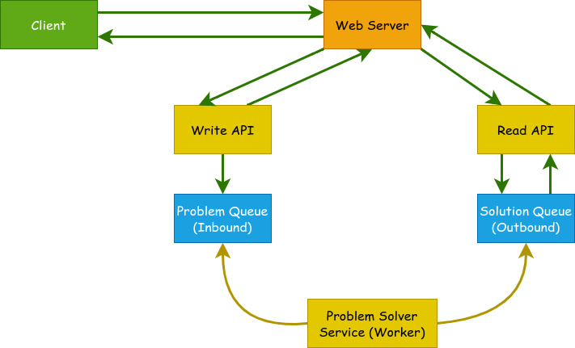

# tsp

Vehicle routing problem-solving web service.


## Design



This API service was built with standard Django. For simplicity's sake, it has been kept stateless so no persistant database was used.

There are three primary components to the system.

1. API
2. Queue
3. Background Worker


### API

There are two possible client-server flows, which are discussed below:

**Scenario A:**

1. The **Client** sends a request with proper data to the **Write API**.
2. The **Server** generates a random id (uuid version 4) and attaches it to the user's payload.
3. The **Server** sends the payload (along with generated id) to the underlying **Problem Queue**.
4. The **Server** responds the user with the id and an url where the solution can be read from the **Solution Queue**.

**Scenario B:**

1. The **Client** sends a request to the **Read API** url (obtained from *Scenario A*).
2. The **Server** reads the solution from the **Solution Queue** with the id from user's request.
3. The **Server** responds the user with the solution.

### Queue

The system utilizes two durable queues from *rabbitmq* to maintain communication between the **API** server and the **Background Worker**. The inbound queue is used for storing problem statements and the outbound queue is used for storing the solutions.

### Background Worker

The background worker runs independently and does not rely on the API server. It reads problems from the inbound queue (**Problem Queue**), uses the underlying optimization library to solve the problem and write the solution to the outbound queue (**Solution Queue**).

## API Documentation

## Request Model

The request model is a JSON object with following properties:

| Property       | Description                                    | Required | Default |
|----------------|------------------------------------------------|----------|---------|
| `locations`    | List of geocoded locations (lat, long).        | *yes*    | `None`  |
| `time_windows` | List of time constraints (min time, max time). | *no*     | `None`  |
| `depot`        | Starting location index.                       | *no*     | `0`     |
| `num_vehicles` | Number of vehicles.                            | *no*     | `1`     |

Example:
```json
{
  "locations": [
    [40.74924, 169.19068],
    [39.28762, 75.30099],
    [-45.81594, 146.19084],
    [-35.28499, 22.68073],
    [16.53802, -148.45893]
  ],
  "time_windows": [
    [0, 5],
    [5, 10],
    [7, 8],
    [10, 15],
    [11, 15]
  ],
  "depot": 0,
  "num_vehicles": 2
}

```

## Response Model

### Without Time Constraints

### With Time Constraints
